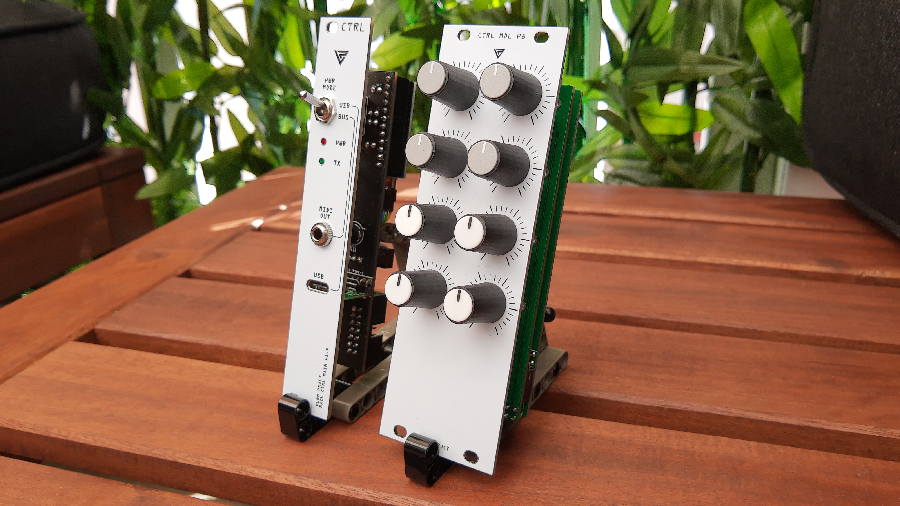

### Support or Contact

Having trouble with the controller ?
[Contact support](https://discuss.tindie.com/users/tme/messages) and i’ll help you sort it out.

### Setup Instructions

- First **( ! )**, for a save buspowered mode use the gray adapter cable
- The last module should have a plugged "Terminator" on `[ OUT ]` ( printed Silklayer )
- Each module must use a unique channel. ( A0 / A1 / A2 / ... / A7 ) and set it to `[ ON ]`
- Set on the blue or red "Terminator" the DIP switch(es) to `[ OFF ]` depending on how many modules are available.
- See image below

### Technical MIDI Informations

- Each module use there own MIDI Channel
- The first module use Channel 16, the second one use Channel 15 and so on.
- The Pots use the MIDI CC numbers 102 – 109, these are unused according MIDI Standard

### Changelog

#### v1.4.2a ( not released )
- Change resitors to SMD Type
- Change Pro Micro USB Pin connector to a smaller footprint
- Change BUS Power to 16 Pin for 5V connection
    **( In some cases the 12V Bus Power will kill the Pro Micro ! )**

#### v1.4.1
- Change to USB C Type

#### v1.4
- Initial version

---

